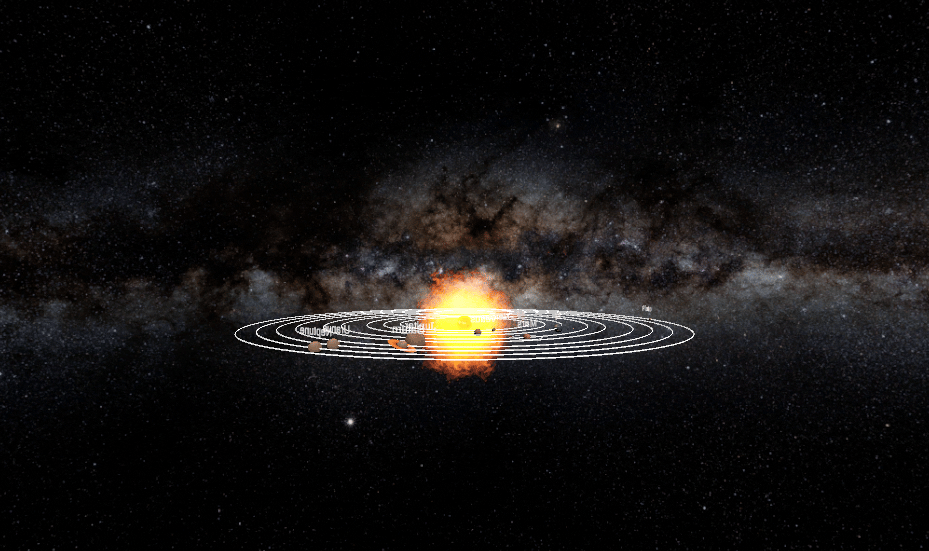

# Solar System VR


An interactive solar-system simulation built in Unity for both desktop exploration and Oculus VR. The project combines orbit visualization, local gravity, moving viewpoints, asteroid interactions, and a spacecraft journey between a station and Mars.



## Experience

The scene presents the solar system as a navigable spatial model rather than a static diagram. Users can move between overview, top, Sun, Earth, Mars, and spacecraft perspectives to understand the system at different scales.

The desktop and VR controller layers call into the same simulation behavior, keeping the model reusable while adapting input to each platform.

## Orbital model and scale

Orbit rings are generated procedurally with `LineRenderer`: each path samples a circle into 100 points, with configurable radius and thickness. Planet scripts manage rotation and orbital movement, while the scene groups related bodies so cameras and spacecraft can follow them coherently.


`PlanetGravity` uses a radius-based overlap query and applies force to nearby rigid bodies. That creates a readable, interactive approximation of gravitational influence—useful for experiencing attraction and landing behavior even though the project is not intended as a numerically exact astronomical model.

## Spacecraft interaction

The spacecraft code models several explicit states:

```text
docked at station
      ↓ land
approach Mars → enter gravity/trigger region → touchdown
      ↓ return
thrust away → interpolate toward station → reset docking state
```

Particle systems, boosters, rigid-body state changes, trigger volumes, and transform parenting work together to make takeoff and landing feel like one continuous sequence. Related Earth/Mars scripts support asteroid spawning, selection, collision response, audio, and impact effects.

## View and control system

The in-world control panel exposes multiple viewpoints and actions, letting a user move from system-scale observation to a close follow view without leaving the experience.


`VRGameViews` stores the active view mode and tracks the selected body every frame when necessary. Keyboard shortcuts provide a desktop testing path, while public click methods connect the same operations to VR buttons.

## Technical highlights

- Unity Universal Render Pipeline for the space scene
- XR Interaction Toolkit, XR Management, Oculus provider, and Unity Input System
- procedural orbit paths using trigonometry and line rendering
- local gravity and rigid-body forces
- stateful spacecraft landing/docking behavior
- collider/trigger-driven asteroid interactions
- particle, sound, and mesh-deformation effects
- desktop and VR-specific control adapters

## Run locally

1. Install Unity Hub and Unity `2022.3.45f1`.
2. Add this repository as a Unity project.
3. Open `Assets/SolarScene4-8.unity`.
4. Press Play for desktop testing, or configure the Oculus runtime/device for VR.

The repository includes project settings and a locked package manifest so Unity can restore the expected XR and rendering dependencies.

## Repository map

```text
.
├── Assets/
│   ├── SolarScene4-8.unity            # Main simulation scene
│   ├── DrawOrbitScript.cs             # Procedural orbit rings
│   ├── PlanetGravity.cs               # Local gravitational force
│   ├── PlanetRotateAround.cs          # Planet rotation behavior
│   ├── EarthScript.cs / Mars.cs       # Planet interactions
│   ├── Spaceship.cs / VRSpaceship.cs  # Flight, landing, and docking
│   ├── GameViews.cs / VRGameViews.cs  # Desktop and VR perspectives
│   └── XR/                             # XR configuration and bindings
├── Packages/                           # Locked Unity dependencies
├── ProjectSettings/                    # Editor, input, graphics, and XR setup
└── images/                             # Three experience demonstrations
```

## Skills demonstrated

Unity, C#, XR interaction design, spatial simulation, vector math, procedural geometry, physics forces, state machines, camera systems, input abstraction, particle/audio feedback, and cross-mode testing.
